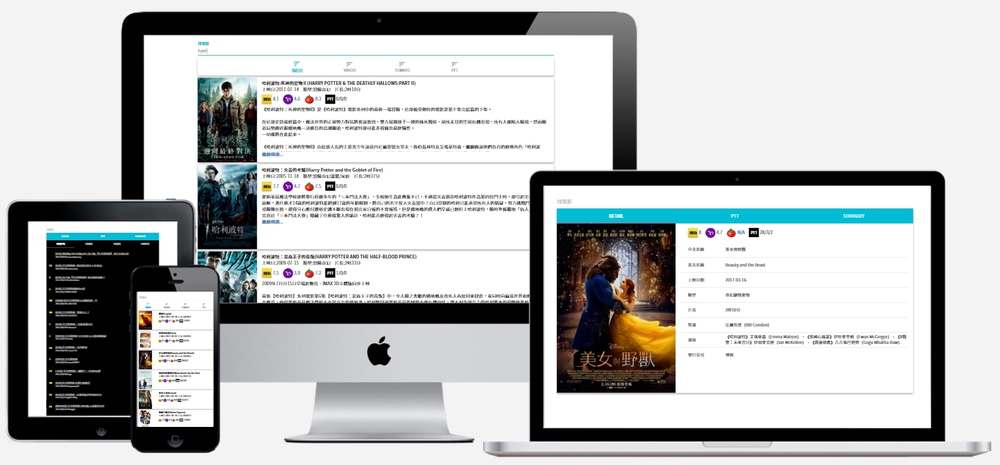
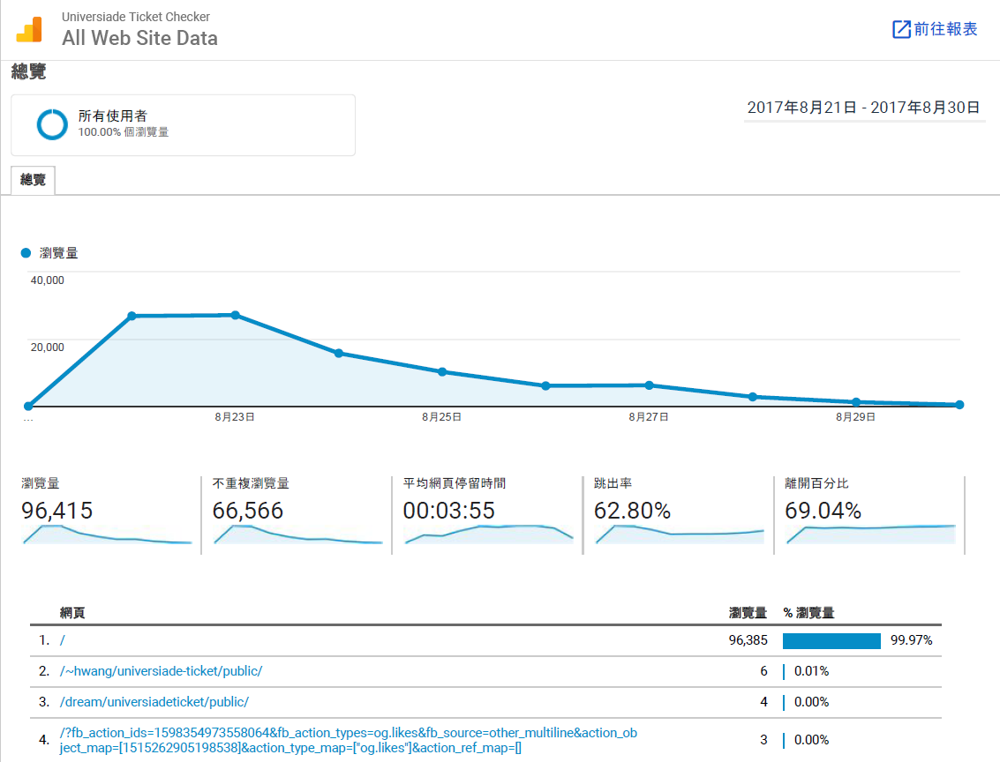
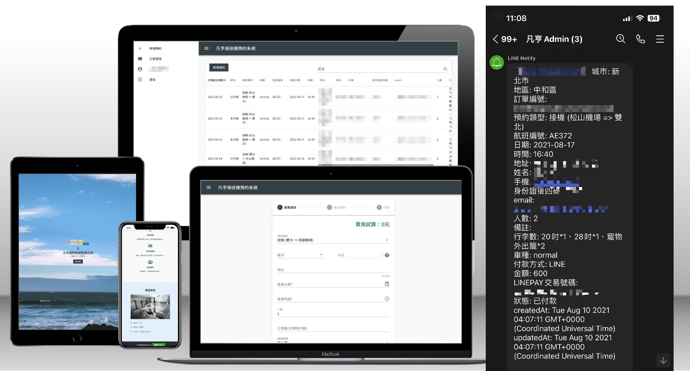
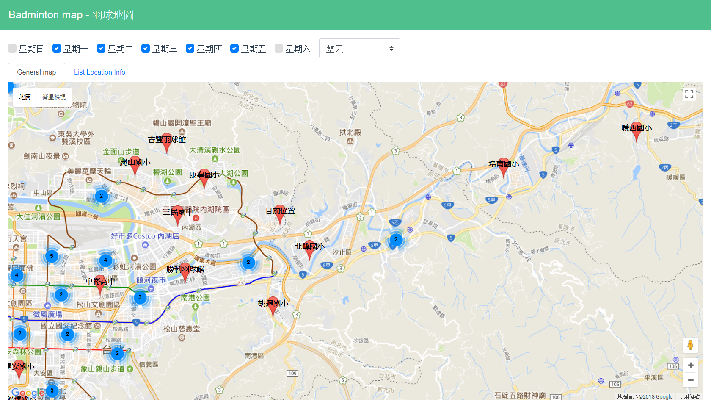
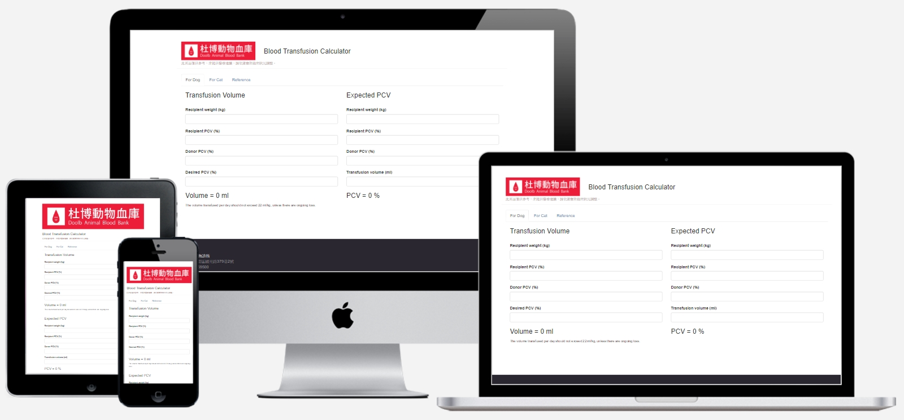

<!-- Multi device mockup generator: https://techsini.com/multi-mockup/ -->

## Enterprise Projects

### [LINE Invoice](https://invoice.line.me/)

- Role: Tech Lead to lead the fullstack development from 0 to 1.
- Scale: 5 millions user, 300 millions invoices
`React` `Typescript` `GraphQL` `Temporal` `Parse-server` `NodeJS` `MySQL` `MongoDB` `k8s` `Knative` `OCR` `GoLang` `Python` `Machine Learning`
> LINE Invoice simplifies the management of daily invoices and receipts for users. Incorporating OCR and machine learning for efficient processing, it stands out for its robust backend infrastructure.

---

### [LINE Shopping](https://buy.line.me/)

- Role: Tech lead for iOS/Andriod development, Frontend Lead developer to build from 0 to 1, DevOps.
- Scale: 10 millions user (1/2 population in Taiwan)
`VueJS` `Typescript` `GraphQL` `Java` `MySQL` `MongoDB` `k8s`
> As Taiwan's leading e-commerce platform, LINE Shopping offers a comprehensive shopping experience across iOS, Android, and web. This project showcases a seamless integration of modern frontend technologies with a scalable backend.

---

### [LINE Travel](https://travel.line.me/)

- Role: Fullstack Lead developer
- Scale: 3 millions user
`VueJS` `NodeJS` `ElasticSearch` `MongoDB` `k8s`
> The top travel agency platform in Taiwan, LINE Travel, partners with renowned companies like Agoda, Booking.com, and Skyscanner to offer unmatched travel deals and options.

---

### [188BET](https://www.188bet.com/)

- Role: Fullstack developer
`AngularJS` `C#` `ASP.NET` `OracleDB` `Windows Server`
> An international online sports betting platform, 188BET provides a secure and dynamic betting experience, leveraging cutting-edge technologies for high performance and reliability.

---

## Small/Medium Business Projects

### [MovieRater](https://www.mvrater.com/) | [Github](https://github.com/Asing1001/movieRater.react)

`PWA` `ServiceWorker` `ReactJS` `Typescript` `NodeJS` `GraphQL` `MongoDB` `Crawler` `Material-UI`
> An innovative platform that aggregates movie ratings from Yahoo, IMDB, PTT, offering a comprehensive search tool for movie enthusiasts.

---

### [The Tung](https://thetungmiaoli.com/)

`WordPress`
> The official website for The Tung Hotel, designed to offer visitors a glimpse into the serene and luxurious accommodations available.

---

### [Universiade Ticket](https://github.com/Asing1001/universiade-ticket) | [Reports](https://www.evernote.com/shard/s234/sh/ad7cea60-1f26-4aac-bfce-eedee5828859/7085f154f1f93772e3dc5a8e36386358)

`VueJS` `Redis` `NodeJS` `Crawler`
> Advanced universiade ticket system, 120+ Github Stars, 10+ News report, 5k buy action, 100k pageview in one week, Daily Top 1 Github trending.

---

### [Nininanaa](https://nininanaa.github.io/)

`Hexo` `CSS` `EJS`
> A personal blog supported over the long term, showcasing a clean design and regular updates.

---

### [Flyer](https://github.com/Asing1001/carsender)

`LINE Pay` `NuxtJS` `Vuetify` `MongoDB`
> An airport transfer booking service in Taiwan, simplifying travel arrangements with ease and efficiency.

---

### [Badminton Map](https://github.com/Asing1001/badmintonmap.vue)

`VueJS` `Python` `Crawler` `MongoDB`
> A dedicated platform providing comprehensive badminton information to the public, from court locations to event schedules.

---

### [ASP.NET MVC Shopping Mall](https://wecarestore.azurewebsites.net/) | [Github](https://github.com/Asing1001/MVCShoppingMall)

`ASP.NET MVC` `MSSQL` `Bootstrap 3`
> An e-commerce platform featuring a back office and user-friendly shopping experience. Demo credentials provided for testing. `admin@admin.com/P@ssw0rd`

---

### Realtime Video Chatroom | [Github](https://github.com/Asing1001/webrtc-website)

`WebRTC` `Socket.io` `NodeJS`
> A platform facilitating real-time video chats, particularly tailored for doctor consultations, showcasing the potential of WebRTC.

---

### [Blood Transfusion Calculator](https://www.paddingleft.com/doolb/) | [Github](https://github.com/Asing1001/acfreetools)

`AngularJS 1.5` `Bootstrap 3`
> A helpful tool for veterinarians to accurately calculate blood transfusion volumes, improving patient care and outcomes.

---

More projects can be found on my [GitHub](https://github.com/asing1001).
