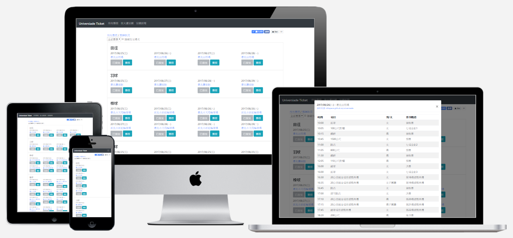

## MovieRater
> [Live Preview](https://www.mvrater.com/) | [Github](https://github.com/Asing1001/movieRater.react)
*Crawl data from Yahoo, IMDB, PTT, for search movies' ratings easily.*
`PWA` `ServiceWorker` `ReactJS` `Typescript` `NodeJS` `GraphQL` `MongoDB` `Crawler` `Material-UI`

## The Tung
> [Live Preview](https://thetungmiaoli.com/)
*The Tung Hotel official Website.*
`Wordpress`

## Universiade ticket
> [Github](https://github.com/Asing1001/universiade-ticket) | [Reports](https://www.evernote.com/shard/s234/sh/ad7cea60-1f26-4aac-bfce-eedee5828859/7085f154f1f93772e3dc5a8e36386358)
*Advanced universiade ticket system, 120+ Github Stars, 10+ News report, 5k buy action, 100k pageview in one week, Daily Top 1 Github trending*
`VueJS` `Redis` `NodeJS` `Crawler`

## Nininanaa
> [Live Preview](https://nininanaa.github.io/)
*Long term support and built blog*
`Hexo` `css` `ejs`

## Badminton map
> [Github](https://github.com/Asing1001/badmintonmap.vue)
*Offer badminton information for public.*
`VueJS` `Python` `Crawler` `MongoDB`

## ASP.NET MVC Shopping mall
>  [Live Preview](https://wecarestore.azurewebsites.net/) | [Github](https://github.com/Asing1001/MVCShoppingMall)
*E-commerce platform, include backoffice, Testing account : `admin@admin.com/P@ssw0rd`*
`ASP.NET MVC` `MSSQL` `Bootstrap 3`

## Realtime video chatroom
> [Live Preview](https://webrtc-realtime-videochat.herokuapp.com/) | [Github](https://github.com/Asing1001/webrtc-website)
*Realtime video chatroom, for doctor consulting*
`WebRTC` `Socket.io` `NodeJS`

## Blood transfusion calculator
> [Live Preview](http://acfreetool.azurewebsites.net/tools/bloodtransfusioncalculator.html) | [Github](https://github.com/Asing1001/acfreetools)
*Blood transfusion calculator is a useful tool for veterinary's daily work.*
 `AngularJS 1.5` `Bootstrap 3`

More project could find in my [Github](https://github.com/asing1001)
