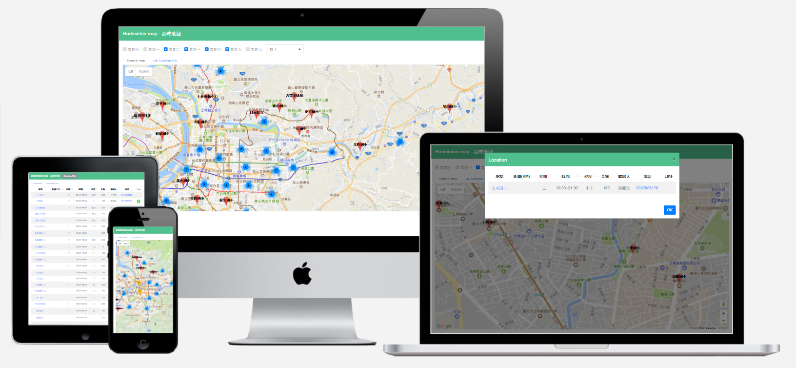

<!-- Multi device mockup generator: https://techsini.com/multi-mockup/ -->

# Professional Experience

## LINE Invoice
>
> [Live Preview](https://invoice.line.me/)
LINE Invoice simplifies the management of daily invoices and receipts for users. Incorporating OCR and machine learning for efficient processing, it stands out for its robust backend infrastructure.
`React` `Typescript` `GraphQL` `Temporal` `Parse-server` `NodeJS` `MySQL` `MongoDB` `k8s` `Knative` `OCR` `GoLang` `Python` `Machine Learning`

## LINE Shopping
>
> [Live Preview](https://buy.line.me/)
*As Taiwan's leading e-commerce platform, LINE Shopping offers a comprehensive shopping experience across iOS, Android, and web. This project showcases a seamless integration of modern frontend technologies with a scalable backend.*
`VueJS` `Typescript` `GraphQL` `Java` `MySQL` `MongoDB` `k8s`

## LINE Travel
>
> [Live Preview](https://travel.line.me/)
*The top travel agency platform in Taiwan, LINE Travel, partners with renowned companies like Agoda, Booking.com, and Skyscanner to offer unmatched travel deals and options.*
`VueJS` `NodeJS` `ElasticSearch` `MongoDB` `k8s`

## 188BET
>
> [Live Preview](https://www.188bet.com/)
*An international online sports betting platform, 188BET provides a secure and dynamic betting experience, leveraging cutting-edge technologies for high performance and reliability.*
`AngularJS` `C#` `ASP.NET` `OracleDB` `Windows Server`

# Personal Projects

## MovieRater
>
> [Live Preview](https://www.mvrater.com/) | [Github](https://github.com/Asing1001/movieRater.react)
*An innovative platform that aggregates movie ratings from Yahoo, IMDB, PTT, offering a comprehensive search tool for movie enthusiasts.*
`PWA` `ServiceWorker` `ReactJS` `Typescript` `NodeJS` `GraphQL` `MongoDB` `Crawler` `Material-UI`

## The Tung
>
> [Live Preview](https://thetungmiaoli.com/)
*The official website for The Tung Hotel, designed to offer visitors a glimpse into the serene and luxurious accommodations available.*
`WordPress`

## Universiade Ticket
>
> [Github](https://github.com/Asing1001/universiade-ticket) | [Reports](https://www.evernote.com/shard/s234/sh/ad7cea60-1f26-4aac-bfce-eedee5828859/7085f154f1f93772e3dc5a8e36386358)
*Advanced universiade ticket system, 120+ Github Stars, 10+ News report, 5k buy action, 100k pageview in one week, Daily Top 1 Github trending*
`VueJS` `Redis` `NodeJS` `Crawler`

## Nininanaa
>
> [Live Preview](https://nininanaa.github.io/)
*A personal blog supported over the long term, showcasing a clean design and regular updates.*
`Hexo` `CSS` `EJS`

## Flyer
>
> [Github](https://github.com/Asing1001/carsender)
*An airport transfer booking service in Taiwan, simplifying travel arrangements with ease and efficiency.*
`LINE Pay` `NuxtJS` `Vuetify` `MongoDB`

## Badminton Map
>
> [Github](https://github.com/Asing1001/badmintonmap.vue)
*A dedicated platform providing comprehensive badminton information to the public, from court locations to event schedules.*
`VueJS` `Python` `Crawler` `MongoDB`

## ASP.NET MVC Shopping Mall
>
> [Live Preview](https://wecarestore.azurewebsites.net/) | [Github](https://github.com/Asing1001/MVCShoppingMall)
*An e-commerce platform featuring a back office and user-friendly shopping experience. Demo credentials provided for testing. `admin@admin.com/P@ssw0rd`*
`ASP.NET MVC` `MSSQL` `Bootstrap 3`

## Realtime Video Chatroom
>
> [Live Preview](https://webrtc-realtime-videochat.herokuapp.com/) | [Github](https://github.com/Asing1001/webrtc-website)
*A platform facilitating real-time video chats, particularly tailored for doctor consultations, showcasing the potential of WebRTC.*
`WebRTC` `Socket.io` `NodeJS`

## Blood Transfusion Calculator
>
> [Live Preview](http://acfreetool.azurewebsites.net/tools/bloodtransfusioncalculator.html) | [Github](https://github.com/Asing1001/acfreetools)
*A helpful tool for veterinarians to accurately calculate blood transfusion volumes, improving patient care and outcomes.*
 `AngularJS 1.5` `Bootstrap 3`

More projects can be found on my [GitHub](https://github.com/asing1001).
