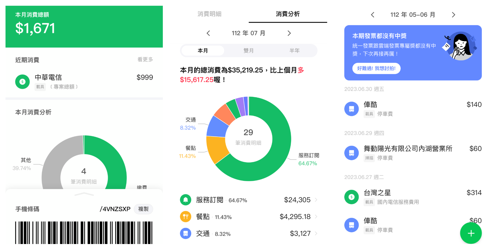

# Sing 的軟體開發服務

我是Sing，目前擔任TikTok技術負責人，擁有豐富的前後端網站開發、DevOps、雲端基礎建設、AI應用和SEO經驗。以下是我的專業背景及聯絡方式，若您有合作意向，歡迎來信聯繫。

- **LinkedIn:** [linkedin.com/in/sing-ming-chen](https://linkedin.com/in/sing-ming-chen)
- **GitHub:** [github.com/asing1001](https://github.com/asing1001)
- **Email:** shinningstar1001@gmail.com
- **LINE:** [shinningstar1001](https://line.me/ti/p/vR_2KJFDFn)

## 專業經驗

### Tech Lead, TikTok Dublin, Ireland (Aug 2023 - Present)
- 帶領歐洲工程團隊開發支持每年80萬台伺服器安裝和故障診斷的軟體。
- 開發數據中心規劃、伺服器交付及監控系統，實現超過100MW數據中心的交付。

### Tech Lead, FullStack, LINE Taipei, Taiwan (Oct 2020 - Aug 2023)
- 領導兩個工程團隊，共14名工程師，從零開始打造 LINE Invoice 和 LINE Shopping App
- 全面優化前後端系統，年處理2億筆交易，涵蓋1000萬用戶。
- 開發發票掃描系統，訓練的機器學習模型比現有模型快100倍。
- 採用 Knative 提高系統可靠性和可擴展性，自動調整工作負載，降低50%基礎設施成本。
- 建立觀察性平台，使用 Grafana/Loki/Prometheus/OpenTelemetry 可視化系統狀態。

### Software Engineer, LINE Taipei, Taiwan (June 2018 - Sep 2020)
- 從零開始開發 LINE Shopping，年增長至1200萬用戶。
- 設計並實現 K8s 集群和 GitOps 管道，實現無停機10分鐘內的構建、部署和擴展。
- 開發 LINE Shopping 促銷系統，在高峰時處理15k RPS 流量。

### Software Engineer, Xuenn Taipei, Taiwan (Oct 2014 - May 2018)
- 開發處理每日200萬訂單的在線遊戲平台，包括數字錢包、促銷系統、產品系統和 CMS。
- 整合來自10多家公司100多個遊戲產品的 API。
- 優化前端和 API 性能，減少50%的加載時間和20%的 CDN 成本。

## 企業專案

### [LINE發票管家](https://invoice.line.me/)
`React` `Typescript` `GraphQL` `Temporal` `NodeJS` `MySQL` `MongoDB` `k8s` `Knative` `OCR` `Python`
> 簡化用戶每日發票和收據管理，結合 OCR 和機器學習，提供穩健的後端基礎設施。

### [LINE購物](https://buy.line.me/)
`VueJS` `Typescript` `GraphQL` `Java` `MySQL` `MongoDB` `k8s`
> 台灣領先的電子商務平台，跨 iOS、Android 和 Web 提供全方位的購物體驗。

### [LINE旅遊](https://travel.line.me/)
`VueJS` `NodeJS` `ElasticSearch` `MongoDB` `k8s`
> 台灣頂級旅遊平台，與 Agoda、Booking.com 和 Skyscanner 等知名公司合作，提供最佳旅遊優惠。

### [188BET](https://www.188bet.com/)
`AngularJS` `C#` `ASP.NET` `OracleDB` `Windows Server`
> 國際線上體育博彩平台，提供安全且動態的博彩體驗，採用先進技術以確保高效能和可靠性。

更多中小型商務專案詳情請參見 https://www.paddingleft.com/portfolio/
